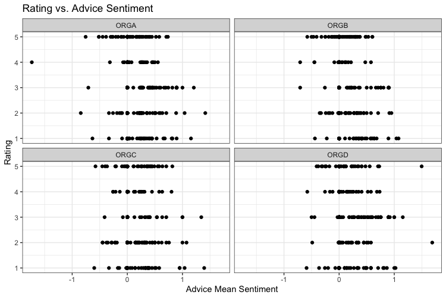

# Glassdoor-Analysis

### Packages:

```r
library(tidyr)
library(dplyr)
library(stringr)
library(lexicon)
library(sentimentr)
library(ggplot2)
library(rpart)
library(lme4)
library(stm)
```

## Cleaning Data:

After importing the data, I decided to analyze each text and identify areas that needed to clean the data. 

```r
load("glassDoor.rdata")
glassdoor2 <- glassDoor
glassdoor2$pros <- glassdoor2$pros %>% 
  gsub("([a-z])(\\d)", "\\1 \\2", .) %>% 
  gsub("([A-Z])(\\d)", "\\1 \\2", .) %>% 
  gsub("^-", "", .) %>% 
  gsub("([a-z])([A-Z])", "\\1 \\2", .) %>% 
  gsub("(\\))(\\w)", "\\1 \\2", .) %>% 
  gsub("\\s+", " ", .) %>% 
  gsub(" , ", ", ", .) %>% 
  str_replace_all(., ">", "") %>% 
  gsub("(\\.)(\\w)", "\\1 \\2", .) %>% 
  gsub("-//s+", " ", .) %>% 
  str_squish(.)

glassdoor2$cons <- glassdoor2$cons %>% 
  gsub("([a-z])(\\d)", "\\1 \\2", .) %>% 
  gsub("([A-Z])(\\d)", "\\1 \\2", .) %>% 
  gsub("^-", "", .) %>% 
  gsub("([a-z])([A-Z])", "\\1 \\2", .) %>% 
  gsub("(\\))(\\w)", "\\1 \\2", .) %>% 
  gsub("\\s+", " ", .) %>% 
  gsub(" , ", ", ", .) %>% 
  str_replace_all(., ">", "") %>% 
  gsub("(\\.)(\\w)", "\\1 \\2", .) %>% 
  gsub("-//s+", " ", .) %>% 
  str_squish(.)

glassdoor2$advice <- glassdoor2$advice %>% 
  gsub("([a-z])(\\d)", "\\1 \\2", .) %>% 
  gsub("([A-Z])(\\d)", "\\1 \\2", .) %>% 
  gsub("^-", "", .) %>% 
  gsub("([a-z])([A-Z])", "\\1 \\2", .) %>% 
  gsub("(\\))(\\w)", "\\1 \\2", .) %>% 
  gsub("\\s+", " ", .) %>% 
  gsub(" , ", ", ", .) %>% 
  str_replace_all(., ">", "") %>% 
  gsub("(\\.)(\\w)", "\\1 \\2", .) %>% 
  gsub("-//s+", " ", .) %>% 
  str_squish(.)
```

### Removing Non-English Words:

To filter out the german words, I filtered out the data that contained the top five german words.

```r
glassdoor3 <- glassdoor2 %>% 
  filter(., !grepl("das", pros)) %>% 
  filter(., !grepl("ist", pros)) %>% 
  filter(., !grepl("du", pros)) %>% 
  filter(., !grepl("ich", pros)) %>% 
  filter(., !grepl("nicht", pros))
```

## Running Sentiment Analysis:

I decided to use the lexicon package hash_sentiment_huliu becasue it was designed for "Opinion Mining, Sentiment Analysis, and Opinion Spam Detection." The text takes on sentiment values of (+1, 0, -1.05, -1, -2). The lexicon takes on the negative 2 when the text takes on a phrase that is always negative such as "too pretty." In addition, I took the row number of each row, so I could later remerge the sentiment analysis to the original table.

```r
glassdoor2$Row_ID <- seq(nrow(glassdoor2))
glassdoor_pros <- sentiment(get_sentences(as.character(glassdoor2$pros)), polarity_dt = lexicon::hash_sentiment_huliu) %>% 
  group_by(element_id) %>% 
  summarize(mean = mean(sentiment))
glassdoor_cons <- sentiment(get_sentences(as.character(glassdoor2$cons)), polarity_dt = lexicon::hash_sentiment_huliu) %>% 
  group_by(element_id) %>% 
  summarize(mean = mean(sentiment))
glassdoor_advice <- sentiment(get_sentences(as.character(glassdoor2$advice)), polarity_dt = lexicon::hash_sentiment_huliu) %>% 
  group_by(element_id) %>% 
  summarize(mean = mean(sentiment))
```

### Merging Columns:

After running the sentiment analysis, I merged the analysis to the original table and added new column titles.

```r
glassdoor_merge <- merge(glassdoor2, glassdoor_pros, by.x = "Row_ID", by.y = "element_id")
colnames(glassdoor_merge)[12] <- "pro_mean"
glassdoor_merge <- merge(glassdoor_merge, glassdoor_cons, by.x = "Row_ID", by.y = "element_id")
colnames(glassdoor_merge)[13] <- "con_mean"
glassdoor_merge <- merge(glassdoor_merge, glassdoor_advice, by.x = "Row_ID", by.y = "element_id")
colnames(glassdoor_merge)[14] <- "advice_mean"
```

## Creating Plots:

I created plots for each rating in the table versuses the three sentiments. In addition, I facet_wrap the data for each organization. Overall, after reviewing the plots, most of the companies seem to follow similar trends.

### Rating vs. Sentiment:

```r
glassdoor_merge$rating <- as.numeric(glassdoor_merge$rating)
glassdoor_merge %>% 
  filter(!is.na(advice_mean)) %>% 
  ggplot(., aes(pro_mean, rating)) + facet_wrap(~organization) +
  geom_point() + theme_bw() + labs(title = "Rating vs. Pro Sentiment")
```


```r
glassdoor_merge %>% 
  filter(!is.na(advice_mean)) %>% 
  ggplot(., aes(con_mean, rating)) + facet_wrap(~organization) +
  geom_point() + theme_bw() + labs(title = "Rating vs. Con Sentiment")
```


```r
glassdoor_merge %>% 
  filter(!is.na(advice_mean)) %>% 
  ggplot(., aes(advice_mean, rating)) + facet_wrap(~organization) +
  geom_point() + theme_bw() + labs(title = "Rating vs. Advice Sentiment")
```



### Work Life Rating vs. Sentiment:

```r
glassdoor_merge %>% 
  filter(!is.na(workLifeRating)) %>% 
  ggplot(., aes(pro_mean, workLifeRating)) + facet_wrap(~organization) +
  geom_point() + theme_bw() + labs(title = "Work Life Rating vs. Pro Sentiment")
```


```r
glassdoor_merge %>% 
  filter(!is.na(workLifeRating)) %>% 
  ggplot(., aes(con_mean, workLifeRating)) + facet_wrap(~organization) +
  geom_point() + theme_bw() + labs(title = "Work Life Rating vs. Con Sentiment")
```


```r
glassdoor_merge %>% 
  filter(!is.na(workLifeRating)) %>% 
  ggplot(., aes(advice_mean, workLifeRating)) + facet_wrap(~organization) +
  geom_point() + theme_bw() + labs(title = "Work Life Rating vs. Advice Sentiment")
```


### Culture Value Rating vs. Sentiment:

```r
glassdoor_merge %>% 
  filter(!is.na(cultureValueRating)) %>% 
  ggplot(., aes(pro_mean, cultureValueRating)) + facet_wrap(~organization) +
  geom_point() + theme_bw() + labs(title = "Culture Value Rating vs. Pro Sentiment")
```


```r
glassdoor_merge %>% 
  filter(!is.na(cultureValueRating)) %>% 
  ggplot(., aes(con_mean, cultureValueRating)) + facet_wrap(~organization) +
  geom_point() + theme_bw() + labs(title = "Culture Value Rating vs. Con Sentiment")
```


```r
glassdoor_merge %>% 
  filter(!is.na(cultureValueRating)) %>% 
  ggplot(., aes(advice_mean, cultureValueRating)) + facet_wrap(~organization) +
  geom_point() + theme_bw() + labs(title = "Culture Value Rating vs. Advice Sentiment")
```


### Career Opportunity Rating vs. Sentiment 

```r
glassdoor_merge %>% 
  filter(!is.na(careerOpportunityRating)) %>% 
  ggplot(., aes(pro_mean, careerOpportunityRating)) + facet_wrap(~organization) +
  geom_point() + theme_bw() + labs(title = "Career Opportunity Rating vs. Pro Sentiment")
```


```r
glassdoor_merge %>% 
  filter(!is.na(careerOpportunityRating)) %>% 
  ggplot(., aes(con_mean, careerOpportunityRating)) + facet_wrap(~organization) +
  geom_point() + theme_bw() + labs(title = "Career Opportunity Rating vs. Con Sentiment")
```


```r
glassdoor_merge %>% 
  filter(!is.na(careerOpportunityRating)) %>% 
  ggplot(., aes(advice_mean, careerOpportunityRating)) + facet_wrap(~organization) +
  geom_point() + theme_bw() + labs(title = "Career Oppirtunity Rating vs. Advice Sentiment")
```


### Management Rating vs. Sentiment:

```r
glassdoor_merge %>% 
  filter(!is.na(managementRating)) %>% 
  ggplot(., aes(pro_mean, managementRating)) + 
  geom_point() + theme_bw() + labs(title = "Management Rating vs. Pro Sentiment")
```


```r
glassdoor_merge %>% 
  filter(!is.na(managementRating)) %>% 
  ggplot(., aes(con_mean, managementRating)) +
  geom_point() + theme_bw() + labs(title = "Management Rating vs. Con Sentiment")
```


```r
glassdoor_merge %>% 
  filter(!is.na(managementRating)) %>% 
  ggplot(., aes(advice_mean, managementRating)) +
  geom_point() + theme_bw() + labs(title = "Management Rating vs. Advice Sentiment")
```


## Topic Models:

```r
pro_data <- glassdoor_merge %>% 
  select(Row_ID, pros)
pro_data <- as_tibble(pro_data)
cons_data <- glassdoor_merge %>% 
  select(Row_ID, cons)
cons_data <- as_tibble(cons_data)
advice_data <- glassdoor_merge %>% 
  select(Row_ID, advice)
advice_data <- as_tibble(advice_data)

set.seed(1001)
holdoutRows = sample(1:nrow(glassdoor_merge), 100, replace = FALSE)
pro_text <- textProcessor(documents = pro_data$pros[-c(holdoutRows)], 
                         metadata = pro_data[-c(holdoutRows),],
                         stem = FALSE)
con_text <- textProcessor(documents = cons_data$cons[-c(holdoutRows)],
                         metadata = cons_data[-c(holdoutRows),],
                         stem = FALSE)
advice_text <- textProcessor(documents = advice_data$advice[-c(holdoutRows)],
                        metadata = advice_data[-c(holdoutRows),],
                        stem = FALSE)
```

### Prep:

```r
pro_prep <- prepDocuments(documents = pro_text$documents,
                          vocab = pro_text$vocab,
                          meta = pro_text$meta)
con_prep <- prepDocuments(documents = con_text$documents,
                          vocab = con_text$vocab,
                          meta = con_text$meta)
advice_prep <- prepDocuments(documents = advice_text$documents,
                             vocab = advice_text$vocab,
                             meta = advice_text$meta)
```

### Determining Number of Topics:

#### Pros:

```r
pro_kTest <- searchK(documents = pro_prep$documents,
                     vocab = pro_prep$vocab,
                     K = c(10, 20, 30, 40), verbose = FALSE)
plot(pro_kTest)
```

#### Cons:

```r
con_kTest <- searchK(documents = con_prep$documents,
                     vocab = con_prep$vocab,
                     K = c(10,20, 30, 40), verbose = FALSE)
plot(con_kTest)
```

#### Advice:

```r
advice_kTest <-  searchK(documents = advice_prep$documents,
                         vocab = advice_prep$vocab,
                         K = c(10,20, 30, 40), verbose = FALSE)
plot(advice_kTest)
```

### Plotting Topics:

#### Pros:

```r
pro_topics_20 <- stm(documents = pro_prep$documents, 
                    vocab = pro_prep$vocab, seed = 1001,
                    K = 20, verbose = FALSE)
plot(pro_topics_20)
```

#### Cons:

```r
con_topics_30 <- stm(documents = con_prep$documents, 
                     vocab = con_prep$vocab, seed = 1001,
                     K = 30, verbose = FALSE)
plot(con_topics_30)
```

#### Advice:

```r
advice_topics_20 <- stm(documents = advice_prep$documents, 
                        vocab = advice_prep$vocab, seed = 1001,
                        K = 20, verbose = FALSE)
plot(advice_topics_20)
```

### Labeling Topics:

#### Pro Topics:

After running the topic models, I labeled the topics to view the ideas that occur frequently. Here is are a few ideas that seem to be in a positive review:

  - Learning and experience:
  
    - People seem to like a job where they learn and gain experiences 
    
  - Encouraging
  
    - Poeple like an evironment that encourages them
    
  - Hours:
  
    - People like hours and schedules that are flexible
    
  - Compensation:
    
    - People like compensation:
    
  - Benefits
  
    - Poeple want good benefits
    
  - Clients and work 
  
    - People want like work with good clients and egagement 

```r
labelTopics(pro_topics_20)
```

#### Con Topics:

Here are a few negative points:

  - Poor Compensation
  
  - Poor work life balance and company culture 
  
  - People don't like budget cuts
  
  - It seems people don't like travel
  
  - People do not like difficult processes

```r
labelTopics(con_topics_30)
```

#### Advice Topics:

Adice topics:

  - More training 
  
  - Listen
  
  - Company culture
  
  - Keep employees
  
  - respect employees
  
```r
labelTopics(advice_topics_20)
```

### Predicting Ratings:

```r
glassdoor_model_data <- glassdoor_merge %>% 
  select(-Row_ID, -pros, -cons, -advice)
glassdoor_model_data$managementRating <- as.numeric(glassdoor_model_data$managementRating)
glassdoor_model_data$compBenefitsRating <- as.numeric(glassdoor_model_data$compBenefitsRating)
glassdoor_model_data$careerOpportunityRating <- as.numeric(glassdoor_model_data$careerOpportunityRating)
glassdoor_model_data$cultureValueRating <- as.numeric(glassdoor_model_data$cultureValueRating)
glassdoor_model_data$workLifeRating <- as.numeric(glassdoor_model_data$workLifeRating)
```

#### Predicting Rating:

First, I used a decision tree to determine which varaibles would be the most important.

```r
tree_mod <- rpart(
    rating ~ .,
    data = glassdoor_model_data,
    control = rpart.control(cp = 0.005))
tree_mod$variable.importance
```

After reviewing the output, I decided to use careerOpportunityRating, managemnetRating, cultureValueRating, pro_mean, and con_mean. Then, I ran a regression.

```r
rating_model <- lm(rating ~ careerOpportunityRating + managementRating + cultureValueRating + pro_mean + con_mean, data = glassdoor_model_data)
summary(rating_model)
```

After reviewing the output, the variables are all significant and the model outputted an Adjusted R-squared value of 0.384. In addition, I created a plot below.

```r
ggplot(glassdoor_model_data, aes(careerOpportunityRating, rating)) + geom_point() +
  geom_smooth(method = "lm") + ggtitle("Rating vs. Career Opportunity") +
  theme_classic()
```

#### Making Predictions with only Sentiments

After creating a pretty good prediction with sentiment analysis and numerical ratings, I wanted to see how much I could predict using only results from sentimnet values. I decided to focus in on more of the obscure categories such as compBenefitsRating or managemnet rating.

compBenefitsRating:

```r
tree_mod <- rpart(
  compBenefitsRating ~ .,
  data = glassdoor_model_data,
  control = rpart.control(cp = 0.005))
tree_mod$variable.importance
```

I decided to use only pro_mean and advice_mean.

```r
compBenefitsRating_model <- lm(compBenefitsRating ~ pro_mean + advice_mean, data = glassdoor_model_data)
summary(compBenefitsRating_model)
```

The model did not provide much prediction value with an Adjusted R-squared value of 0.0212.

Managemnet Rating:

```r
tree_mod <- rpart(
  managementRating ~ .,
  data = glassdoor_model_data,
  control = rpart.control(cp = 0.005))
tree_mod$variable.importance

compBenefitsRating_model <- lm(managementRating ~ pro_mean + advice_mean, data = glassdoor_model_data)
summary(compBenefitsRating_model)
```

The Adjusted R-squared value was very low and the model did not add much predictive value.

Career Opportunity Rating:

```r
tree_mod <- rpart(
  careerOpportunityRating ~ .,
  data = glassdoor_model_data,
  control = rpart.control(cp = 0.005))
tree_mod$variable.importance
compBenefitsRating_model <- lm(careerOpportunityRating ~ pro_mean + advice_mean + con_mean, data = glassdoor_model_data)
summary(compBenefitsRating_model)
```

The Adjusted R-squared value was very low and the model did not add much predictive value.

Overall, the sentiments alone do not do a great job of making predictions on glassdoor.
